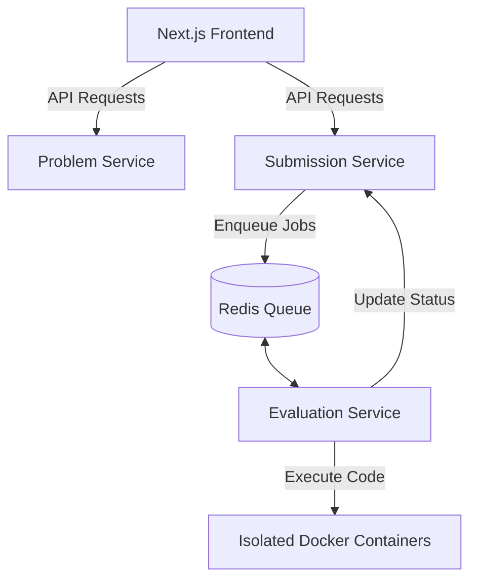

# DevArena 🚀

**DevArena** is a microservices-based online coding judge and challenge platform (a custom LeetCode clone). Developers can browse problems, create custom coding challenges with custom test suites, write solutions in **Python** or **C++**, and run them with real-time feedback inside isolated containerized sandboxes.

---

## 🏗️ Architecture

DevArena is built using a modern decoupled architecture consisting of a frontend client and three distinct backend microservices:



### 1. Next.js Frontend (Port `3001`)
- Built with **Next.js 16 (React 19)**, **Tailwind CSS**, and **Lucide React**.
- Leverages Server Actions for seamless client-server interaction.
- Provides a clean, modern coding dashboard for browsing problems, creating customized coding tests, and viewing evaluation history.

### 2. Problem Service (Port `3000`)
- **Express.js & MongoDB** service.
- Manages problems, descriptions, difficulties, and test case datasets.

### 3. Submission Service (Port `3002`)
- **Express.js & MongoDB** service.
- Registers user code submissions, stores submission statuses (`pending`, `accepted`, `wrong_answer`), and delegates evaluation tasks to Redis.

### 4. Evaluation Service (Port `3003`)
- **Express.js, Redis, BullMQ, & Dockerode**.
- Listens to the submission queue, spins up isolated Docker containers (`python:3.8-slim` for Python and `gcc:latest` for C++), runs compilation/execution with sandboxed stdin injection, and updates statuses.

---

## 🛠️ Prerequisites

To run this project locally, ensure you have the following installed:
- [Node.js](https://nodejs.org/) (v18 or higher)
- [MongoDB](https://www.mongodb.com/) (running on `localhost:27017`)
- [Redis](https://redis.io/) (running on `localhost:6379`)
- [Docker Desktop](https://www.docker.com/products/docker-desktop/) (running on your machine)

---

## 🚀 Getting Started

### 1. Clone & Set Up Databases
Make sure your MongoDB and Redis instances are running locally. 

If you use Docker, you can run Redis using:
```bash
docker run -d --name redis -p 6379:6379 redis:alpine
```

Ensure **Docker Desktop** is active so the worker can spin up execution containers.

### 2. Start the Backend Services
Navigate to each service directory in the `Backend/` folder, install dependencies, and run in developer mode:

#### Problem Service
```bash
cd Backend/ProblemService
npm install
npm run dev
```

#### Submission Service
```bash
cd Backend/SubmissionService
npm install
npm run dev
```

#### Evaluation Service
```bash
cd Backend/EvaluationService
npm install
npm run dev
```

### 3. Start the Frontend App
Navigate to the `frontend/` directory, install dependencies, and run:
```bash
cd frontend
npm install
npm run dev
```

Open [http://localhost:3001](http://localhost:3001) in your browser to start coding!

---

## 🧪 How Code Evaluation Works

1. The frontend posts code, language, and problem ID to the **Submission Service**.
2. The Submission Service saves the record as `pending` and publishes a job containing the problem details and code payload into the **Redis Queue (BullMQ)**.
3. The **Evaluation Service** worker picks up the job and:
   - Compiles the code (for C++) inside a sandboxed container.
   - Feeds inputs from the database test cases via standard input (`stdin`).
   - Compares the container standard output (`stdout`) against the expected output values (ignoring leading/trailing whitespaces).
4. If the output matches all test cases, the submission is updated to `accepted`. Otherwise, it marks it as `wrong_answer` (which also handles timeout errors).

---

## ⚙️ Configuration & Timeouts

Compilation and execution limits are configurable under `Backend/EvaluationService/src/config/language.config.ts`:
- **Python**: 4000ms timeout
- **C++**: 5000ms timeout (extended to allow headroom for `g++` compilation inside WSL2/Docker environments)
